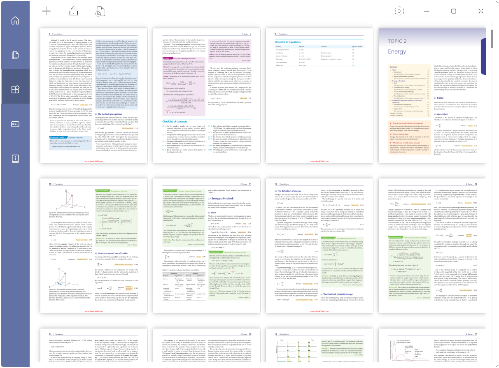

# pyPDFeditor-GUI

[](https://pypi.org/project/pyPDFeditor-GUI/)
[](https://pepy.tech/project/pyPDFeditor-GUI)


This project is based on PyQt5 and PyMuPDF and tested on Windows 10 & 11.

## Welcome 🎃🎉

Welcome to use pyPDFeditor-GUI. pyPDFeditor-GUI is a simple cross-platform application, thanks
to [Python](https://www.python.org/), [PyQt5](https://www.riverbankcomputing.com/software/pyqt/)
and [PyMuPDF](https://github.com/pymupdf/PyMuPDF), designed to work on simple PDF handling.

I tried my best to make it close to Fluent UI. Icons used can be found [🔗here](https://fluenticons.co/).

## Features

* Support 3 languages: English, 日本語 (Japanese), and 中文 (Traditional Chinese)
* Fluent UI design
* Cross-platform support
* Open-source and free to use under MIT licence
* Frameless Window on
  Windows ([Snap Layout](https://answers.microsoft.com/en-us/windows/forum/all/how-to-use-snap-layouts-and-snap-groups-in-windows/3213a6b6-5a33-4d40-bbce-e01388a40976)
  on Windows 11 is supported)

## What's in

* Merge files no matter they are PDF files (`.pdf`), image files (`.jpg` `.png` `.jpeg` `.bmp` `.tiff` `.svg`), or
  e-book files (`.epub` `.xps` `.fb2` `.cbz`) into one PDF file📚
* (...right-click the page then) Delete pages or rearrange pages
* (...right-click the page then) Extract images from a page
* (...right-click the page then) Rotate a page
* (...right-click the page then) Save a page as a PDF file or image file (`.png` `.psd` `.ppm`)
* Add watermark (PDF only)
* Set password either user or/and owner password (PDF only)🔒
* Set permissions (PDF only)🔏
* Edit catalogue structure of the file (PDF only)📑
* Edit metadata of the file (PDF only)📝
* Convert image files or e-book files to PDF

## Requirements 🧩

```text
Python>=3.7
```

```text
PyQt5>=5.15.4
PyMuPDF>=1.19.2
```

## Install & Run

### install from source

you will need `setuptools` and `wheel` installed

```bash
$ cd <path>
$ pip install .
```

where `<path>` is the directory `setup.py` locates.

### install from PyPi

```bash
$ pip install -U pyPDFeditor-GUI
```

### build thy own package

this requires `build`, `setuptools` and `wheel` installed

```bash
$ pip install -r requirements.txt
$ python -m build
```

### Run

* `$ pdfeditor` to launch the application.

* `$ python -m pypdfeditor_core --reset` to reset the application; this will delete all settings and caches. Default
  settings will be created at next launch.

* `$ python -m pypdfeditor_core --remove` to remove the whole application.
* `$ python -m pypdfeditor_core --debug` to enable showing all mupdf errors and/or warnings.

## Screenshot 🎞️

on Windows 11:



Support [Snap Layouts](https://answers.microsoft.com/en-us/windows/forum/all/how-to-use-snap-layouts-and-snap-groups-in-windows/3213a6b6-5a33-4d40-bbce-e01388a40976)
on Windows 11

## Others

Setting and cache files are stored in the directory `C:\User\USER\.pyPDFeditor-GUI` (Windows) or `home/USER/.pyPDFeditor-GUI`
(Linux and macOS).

Please report any errors to [Issues](https://github.com/Augus1999/pyPDFeditor-GUI/issues). Thank you!
