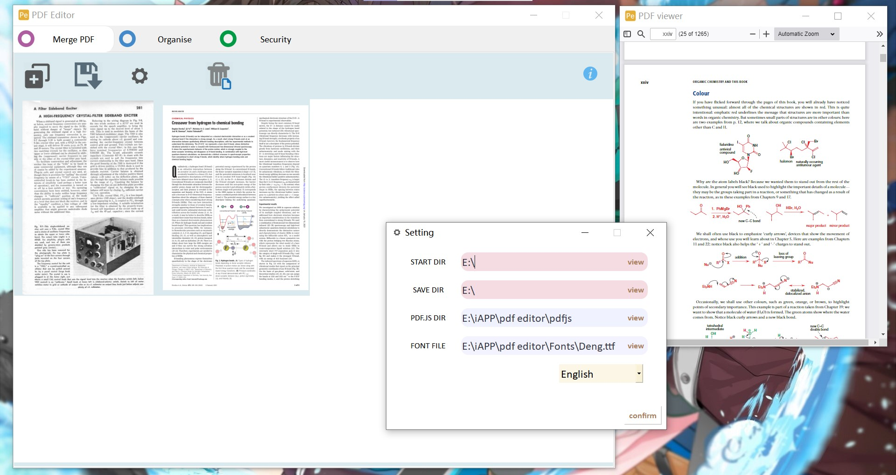

# pyPDFeditor-GUI

This project is based on PyQt5 and PyMuPDF and tested on Python 3.8.6 & 3.9.7 on Windows 10.

## Welcome

Welcome to use pyPDFeditor-GUI. pyPDFeditor-GUI is a simple cross-platform application, thanks to [Python](https://www.python.org/), [PyQt5](https://www.riverbankcomputing.com/software/pyqt/) and [PyMuPDF](https://github.com/pymupdf/PyMuPDF), designed to work on simple PDF handling including merging files, organising pages, saving page as image, extracting images from page, setting passwords (user or/and owner password), and adding watermarks.

I tried my best to make it close to Fluent UI. Icons used can be found [here](https://fluenticons.co/). 

## Install & Run
Run `$ pip install -r requirements.txt` to install all required packages.

Run `$ python pdfEditor.py` to open the application window.

If you are working on Windows platform and having no Python 3 installed, download pyinstaller-prepackaged executable files [here](https://github.com/Augus1999/pyPDFeditor-GUI/releases).

## Screenshot

## Others

I wrote this scripts as robust as possible. If you encountered any crash and could not see any error from PyQt and python itself, open the python file `pdfEditor.py` in IDE, find line 8, change the state `debug=False` into `debug=True`, and run the application again. Then you will see all mupdf errors in terminal. Please report these errors to [Issues](https://github.com/Augus1999/pyPDFeditor-GUI/issues). Thank you!

