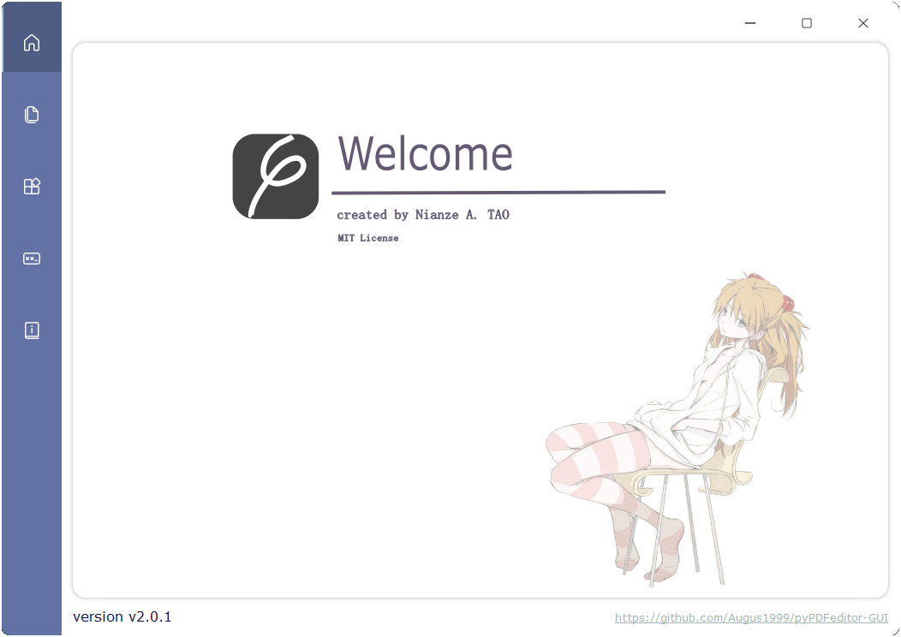
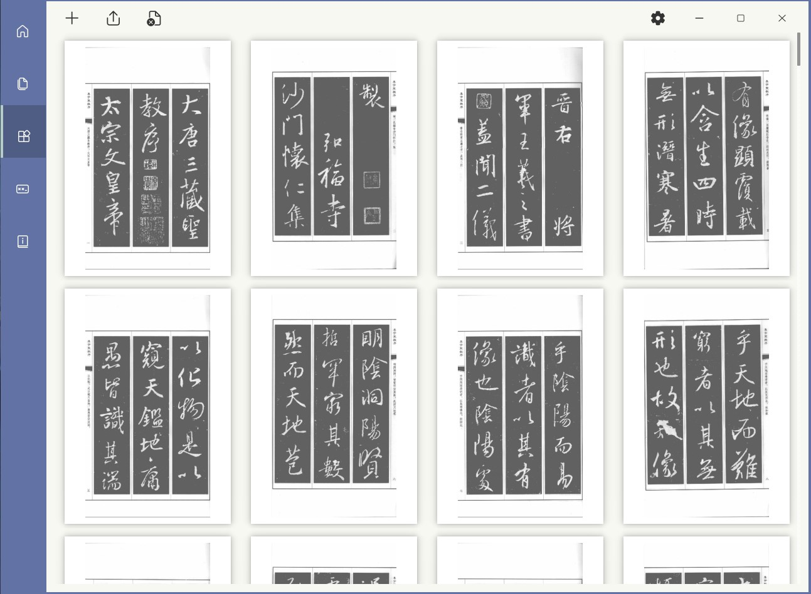
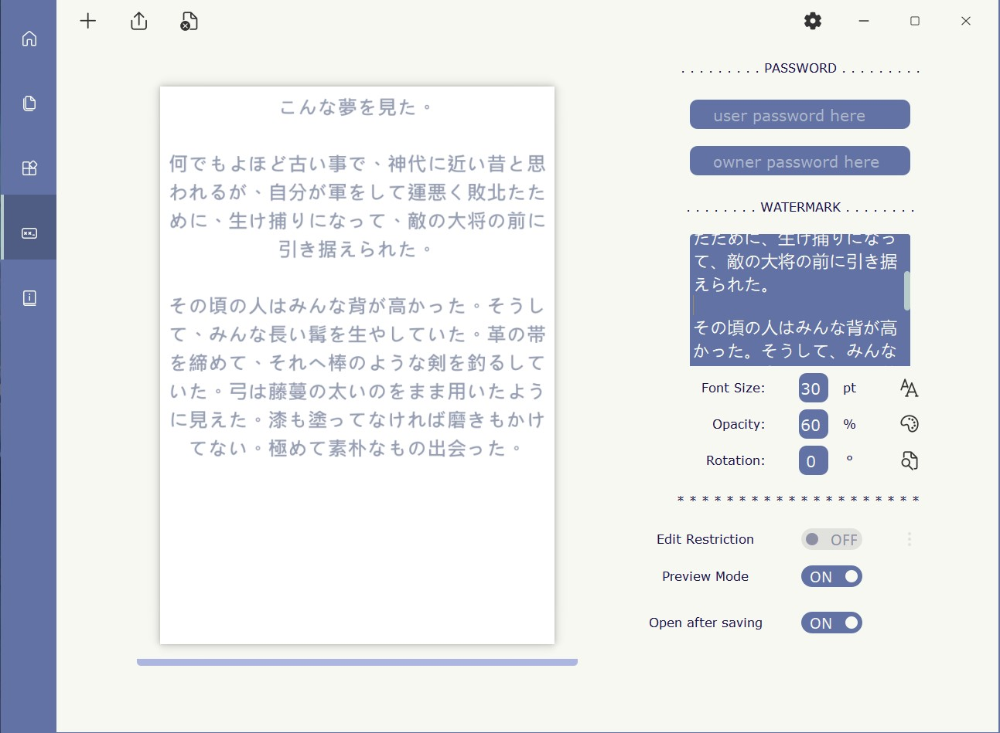

# pyPDFeditor-GUI 

This project is based on PyQt5 and PyMuPDF and tested on Python 3.8.6 & 3.9.7 on Windows 10 & 11.

Current version is v2.0.1 ⌛

## Welcome 🎃🎉

Welcome to use pyPDFeditor-GUI. pyPDFeditor-GUI is a simple cross-platform application, thanks
to [Python](https://www.python.org/), [PyQt5](https://www.riverbankcomputing.com/software/pyqt/)
and [PyMuPDF](https://github.com/pymupdf/PyMuPDF), designed to work on simple PDF handling.

I tried my best to make it close to Fluent UI. Icons used can be found [🔗here](https://fluenticons.co/).

## Features

* Support 3 languages: English, 日本語 (Japanese), and 中文 (Traditional Chinese)
* Fluent UI design
* Cross-platform support
* Open-source and free to use under MIT licence

## What's in

* Merge files no matter they are PDF files (`.pdf`), image files (`.jpg` `.png` `.jpeg` `.bmp` `.tiff` `.svg`), or
  e-book files (`.epub` `.xps` `.fb2` `.cbz`) into one PDF file📚
* (...right-click the page then) Delete pages or rearrange pages
* (...right-click the page then) Extract images from a page
* (...right-click the page then) Rotate a page
* (...right-click the page then) Save a page as a PDF file or image file (`.png` `.jpg`)
* Add watermark (PDF only)
* Set password either user or/and owner password (PDF only)🔒
* Set permissions (PDF only)🔏
* Edit catalogue structure of the file (PDF only)📑
* Edit metadata of the file (PDF only)📝
* Convert image files or e-book files to PDF

## Required Packages 🧩

Core:

```ASN.1
PyQt5>=5.15.4
PyMuPDF>=1.19.0
```

optional if running on Windows:

```ASN.1
pywin32>=301
```

## Install & Run

Run `$ pip install -r requirements.txt` to install all required packages.

Run `$ python pdfEditor.py` to open the application window.

If you are working on Windows platform and having no Python 3 installed, download pyinstaller-prepackaged executable
files [here](https://github.com/Augus1999/pyPDFeditor-GUI/releases).

### Using on Windows

If you want the UI has a native round border and shadow effect on <u>Windows 11</u>, go to the python
file [`📄pdfEditor.py`](pdfEditor.py), find <u>line 8</u>, change the state `system_style=False` into `system_style=True`,
and run the application again. It may affect the colour theme. The default setting is no-shadow-effect and border radius
= 0.

Also, [Snap Layout Menu](https://docs.microsoft.com/zh-cn/windows/apps/desktop/modernize/apply-snap-layout-menu) in
Windows 11 is fully supported.

## Screenshots 🎞️

using system style on Windows 11:




default window style on Windows platform:





## If you want to change the theme 🎨

The default Theme is written in the file [`📄style_sheets.py`](scripts/style_sheets.py)of folder [`📁scripts`](scripts). Of course,
you are welcomed to change it or create a new one. Just remember to keep the same variable names and same formats,
especially the format of `SWITCH_STYLE` item, or you may well encounter errors😶 .If you create a new theme, then put
it into folder [`📁scripts`](scripts), go to <u>line 11</u> of [`📄windows.py`](scripts/windows.py) and change:

```python
from .style_sheets import *
```

into `from YOUR_STYLESHEETS import *` for instance:

```python
from .style_sheets_yurucamp_shimaRIN import *
```

You are also welcomed to share your themes [🔗here](https://github.com/Augus1999/pyPDFeditor-GUI/pulls).

## Others

I wrote this scripts as robust as possible. If you encountered any crash and could not see any error from PyQt and
python itself, open the python file [`📄pdfEditor.py`](pdfEditor.py) in IDE, find <u>line 10</u>, change the
state `debug=False` into `debug=True`, and run the application again. Then you will see all mupdf errors (and warnings)
in terminal. Please report these errors to [Issues](https://github.com/Augus1999/pyPDFeditor-GUI/issues). Thank you!
