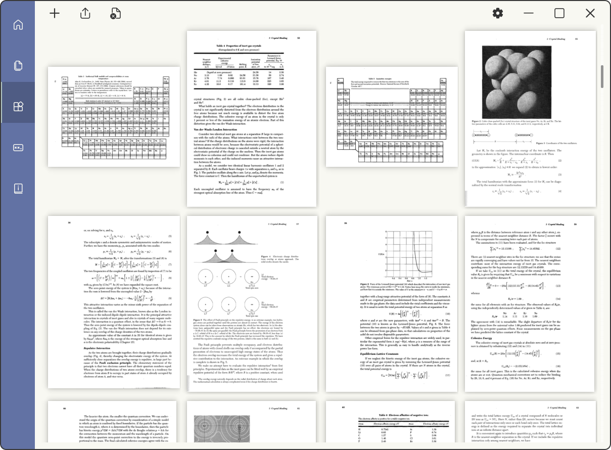

# pyPDFeditor-GUI

This project is based on PyQt5 and PyMuPDF and tested on Python 3.8 & 3.9 & 3.10 on Windows 10 & 11.

Current version is v2.1.0 ⌛

## Welcome 🎃🎉

Welcome to use pyPDFeditor-GUI. pyPDFeditor-GUI is a simple cross-platform application, thanks
to [Python](https://www.python.org/), [PyQt5](https://www.riverbankcomputing.com/software/pyqt/)
and [PyMuPDF](https://github.com/pymupdf/PyMuPDF), designed to work on simple PDF handling.

I tried my best to make it close to Fluent UI. Icons used can be found [🔗here](https://fluenticons.co/).

## Features

* Support 3 languages: English, 日本語 (Japanese), and 中文 (Traditional Chinese)
* Fluent UI design
* Cross-platform support
* Open-source and free to use under MIT licence
* Frameless Window on
  Windows ([Snap Layout](https://answers.microsoft.com/en-us/windows/forum/all/how-to-use-snap-layouts-and-snap-groups-in-windows/3213a6b6-5a33-4d40-bbce-e01388a40976)
  on Windows 11 is supported)

## What's in

* Merge files no matter they are PDF files (`.pdf`), image files (`.jpg` `.png` `.jpeg` `.bmp` `.tiff` `.svg`), or
  e-book files (`.epub` `.xps` `.fb2` `.cbz`) into one PDF file📚
* (...right-click the page then) Delete pages or rearrange pages
* (...right-click the page then) Extract images from a page
* (...right-click the page then) Rotate a page
* (...right-click the page then) Save a page as a PDF file or image file (`.png` `.psd` `.ppm`)
* Add watermark (PDF only)
* Set password either user or/and owner password (PDF only)🔒
* Set permissions (PDF only)🔏
* Edit catalogue structure of the file (PDF only)📑
* Edit metadata of the file (PDF only)📝
* Convert image files or e-book files to PDF

## Requirements 🧩

```text
Python>=3.7
```

```text
PyQt5>=5.15.4
PyMuPDF>=1.19.2
```

## Install & Run

### install from source

you will need `setuptools` and `wheel` installed

* first `cd` to where `setup.py` locates

```bash
$ cd <path>
```

* then run

```bash
$ pip install .\
```

### install from PyPi

[](https://pepy.tech/project/pyPDFeditor-GUI)

```bash
$ pip install -U pyPDFeditor-GUI
```

### build thy own package

this requires `build`, `setuptools` and `wheel` installed

* run `$ python -m build -n` on Windows; run `$ python3 -m build -n` on macOS and Linux

### Run

* `$ pdfeditor` to launch the application.

* `$ python -m pypdfeditor_core --reset` to reset the application; this will delete all settings, caches and icons. Default settings and
  icons will be created at next launch.

* `$ python -m pypdfeditor_core --remove` to remove the whole application.

## Screenshot 🎞️

on Windows 11:



Support [Snap Layouts](https://answers.microsoft.com/en-us/windows/forum/all/how-to-use-snap-layouts-and-snap-groups-in-windows/3213a6b6-5a33-4d40-bbce-e01388a40976)
on Windows 11

## Others

Icons and setting files are stored in the directory `C:\User\USER\.pyPDFeditor-GUI` (Windows)
or `home/USER/.pyPDFeditor-GUI` (Linux). Please reset the application if icons display incorrectly after upgrading.

Please report any errors to [Issues](https://github.com/Augus1999/pyPDFeditor-GUI/issues). Thank you!
